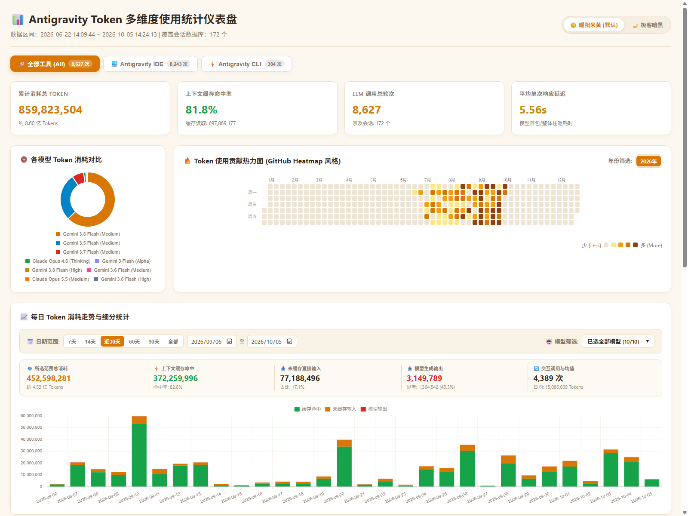
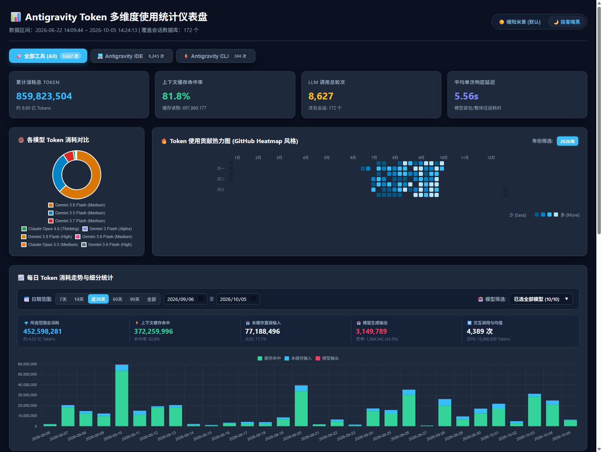

# 📊 Antigravity Token Statistics & Multi-Dimensional Visual Analytics

<p align="center">
  <a href="README.md">简体中文</a> | <b>English</b>
</p>

A high-performance, lightweight, multi-dimensional Token usage statistics, deep analytics, and modern interactive dashboard tool crafted for **Google Antigravity** (Antigravity IDE & Antigravity CLI).

Effortlessly extracts full model invocation metadata from local conversation databases, delivering comprehensive insights including model distribution, timeline trends, GitHub-style contribution heatmaps, an interactive single-file HTML dashboard, and structured Markdown reports.

---

## 📸 Interactive Dashboard Preview

Designed with a self-contained, single-file architecture that automatically adapts to device screens, featuring instant switching between themes and tool views:

### 1. ☀️ Warm Light Theme (Default)
Ideal for daytime productivity and long-duration data exploration with a soft, paper-like warm palette:



### 2. 🌙 Geek Dark Theme (Optional)
Deep Slate dark tones with vibrant tech accents; chart palettes adapt automatically with persistent local memory:



### Core Capabilities at a Glance
- **Global Tool Filtering**: Seamlessly toggle between `All Tools`, `Antigravity IDE`, and `Antigravity CLI` with real-time whole-page sync; persistent dual-theme switching.
- **Golden-Ratio Symmetrical Grid**: Compact side-by-side layout featuring model consumption donut charts on the left and a 52-week GitHub-style contribution heatmap on the right, eliminating wasted whitespace.
- **Full-Width Daily Trend Chart**: Horizontal panoramic daily token consumption bar chart with preset date capsules, custom date-range pickers, multi-select model dropdowns, and **real-time dynamic summation metric cards**.
- **Deep Metrics & Breakdown**: Granular breakdown of Windows vs. WSL2 environments, context cache hit rates, Thinking Tokens (Chain-of-Thought), and model response latency.

---

## ⚙️ Technical Architecture & Principles

This tool requires zero heavyweight external services or database servers. It achieves sub-second, highly reliable extraction and analytics via native filesystem protocol scanning and binary protocol decoding.

```
  ┌─────────────────────────────────────────────────────────────┐
  │         1. Adaptive Cross-Platform / Machine Discovery      │
  │   Windows: C:\Users\*\.gemini\antigravity-ide\conversations │
  │   WSL2:    \\wsl.localhost\<distro>\root & home\*\.gemini   │
  └──────────────────────────────┬──────────────────────────────┘
                                 │
                                 ▼
  ┌─────────────────────────────────────────────────────────────┐
  │         2. Lock-Free SQLite Read-Only Access (I/O Safe)     │
  │         URI: file:{db_path}?mode=ro&immutable=1             │
  │         - Avoids WSL2 9P/virtio-fs network filesystem locks │
  │         - Prevents write-lock conflicts with active IDE     │
  └──────────────────────────────┬──────────────────────────────┘
                                 │
                                 ▼
  ┌─────────────────────────────────────────────────────────────┐
  │         3. Native Python Protobuf Binary Wire Decoder       │
  │   Parses raw binary blobs in the `gen_metadata` table       │
  │   - Wire Type 0 (Varint) / Wire Type 2 (Length-delimited)   │
  │   - Zero .proto compilation; extracts tokens & metadata     │
  └──────────────────────────────┬──────────────────────────────┘
                                 │
                                 ▼
  ┌─────────────────────────────────────────────────────────────┐
  │         4. Multi-Dimensional Aggregation & Dashboard Render │
  │   Generates Antigravity_Token_Dashboard.html and launches   │
  │   the system default browser automatically                  │
  └─────────────────────────────────────────────────────────────┘
```

### 1. Which Directories Are Scanned? (Adaptive Discovery)
The tool completely eliminates any hardcoded machine models or usernames, automatically identifying data locations across diverse environments:
- **Windows Local Environment**:
  - Current user directories: `~/.gemini`, `~/.antigravity`
  - Global user volume scan: Dynamically enumerates all real user profiles under `%SystemDrive%\Users` for `.gemini/antigravity-ide/conversations/*.db` and CLI directories.
- **WSL2 Subsystem Environment**:
  - Automatically queries Windows native Registry (`HKCU\Software\Microsoft\Windows\CurrentVersion\Lxss`) for **sub-millisecond discovery** (< 0.001s), completely eliminating network broadcast timeouts and `wsl.exe` process overhead;
  - Traverses Linux filesystems directly via native Windows UNC network paths: `\\wsl.localhost\<distro>\root\.gemini\antigravity-ide\conversations\*.db` and `\\wsl.localhost\<distro>\home\<user>\.gemini\...`, requiring no internal WSL agent.

### 2. How Are Databases Read? (Lock-Free & Concurrency-Safe)
When reading local SQLite conversation databases, the process must guarantee zero interference with the running IDE while preventing file lock deadlocks:
- **SQLite Read-Only Immutable URI Mode**:
  ```python
  uri = f"file:{norm_path}?mode=ro&immutable=1"
  conn = sqlite3.connect(uri, uri=True)
  ```
- **Underlying Principle**:
  - `mode=ro`: Opens the database in strict read-only mode, eliminating accidental writes;
  - `immutable=1`: Signals SQLite that the underlying file remains unchanged for the connection's lifetime. **SQLite bypasses acquiring POSIX/Windows file locks entirely, and will never create or verify `-shm` (shared memory) or `-wal` (write-ahead log) temporary files**;
  - **Problem Solved**: Completely prevents `database is locked`, `disk I/O error`, or main-thread hangs commonly triggered when querying files across Windows and WSL2 virtual network filesystems (9P / virtio-fs).

### 3. How Is Data Decoded? (Pure Python Protobuf Wire Decoder)
Detailed invocation logs in Antigravity are serialized as Protocol Buffers binary blobs within the `gen_metadata` SQLite table:
- **Zero `.proto` Dependency Decoding** (`proto_decoder.py`):
  - Because internal Antigravity Protobuf schema definitions are private, and importing Google's official `protobuf` library adds unnecessary bloat;
  - Built-in lightweight binary wire format parser adhering strictly to the Google Protocol Buffers specification;
  - Implements **Variable-Length Quantity (Varint)** decoding to resolve field tags (`field_num`) and wire types (`wire_type`);
  - Recursively traverses Wire Type 2 (Length-delimited) embedded sub-messages directly on raw byte streams.
- **Extracted Fields**:
  - Model Name: `gemini-3.8-flash`, `gemini-2.5-pro`, etc.;
  - Prompt Breakdown: Raw uncached input tokens (`prompt_tokens`), system instructions, and tool declarations;
  - Context Cache Hit: `cached_content_token_count` for precise computation of cache savings;
  - Candidate Output: `candidates_token_count`, with deep extraction of Chain-of-Thought Thinking Tokens (`thinking_token_count`);
  - Latency & Timestamps: Millisecond-precision start/finish timestamps for latency analysis and time-series aggregation.

### 4. ⚡ Local Incremental Caching (15x+ Performance Leap)
Analyzing hundreds of conversation databases and decoding tens of thousands of binary Protobuf messages on every execution introduces repetitive I/O overhead. The tool incorporates an **intelligent incremental caching system**:
- **Dual-Fingerprint Verification**: Generates a composite fingerprint `(mtime, size)` based on file modification timestamp and byte size for each database;
- **Zero-Redundancy Historical Invocations**: Unmodified databases are instantly loaded from the local cache file (`.token_cache.json`), bypassing SQLite connection initialization and raw bytecode deserialization entirely;
- **Incremental Hot Sync**: Only newly initiated conversations or active sessions receiving fresh token writes undergo parsing, with results automatically merged into the local cache;
- **Instant Execution**: Execution time is compressed from **~20 seconds down to ~1 second (near instantaneous)**;
- **Force Refresh**: Pass `--no-cache` or `--force-refresh` (or `-f`) at any time to execute a clean, full re-parse.

### 5. Dependency Manifest (Zero External Heavy Dependencies)
The project strictly adheres to a **lightweight, minimalist, battery-included** design philosophy:
- **Python Backend**: **100% Python 3.8+ Standard Library** — no `pip install` required!
  - `sqlite3`: Native database query engine with URI support;
  - `json`: Structured serialization for analytics;
  - `os`, `sys`, `pathlib`: Cross-platform path normalization;
  - `winreg`: Instant Windows Registry enumeration for WSL2 distributions;
  - `subprocess`: Fallback distribution discovery;
  - `datetime`, `time`: Timestamp transformations and matrix dates;
  - `re`: Regex parsing for model identifiers;
  - `webbrowser`: Auto-opens the system default browser upon completion.
- **Frontend Dashboard**:
  - Single-file native HTML architecture (Vanilla HTML5 / CSS3 / JavaScript) with zero Webpack, Vite, or Node.js build dependencies;
  - Leverages lightweight open-source `Chart.js` via CDN for crisp vector charts;
  - Completely offline-capable: open the generated HTML file directly in any browser anytime.

---

## 🚀 Quick Start

### 1. Requirements
- Operating System: Windows 11 / 10, Linux, or macOS
- Python: Python 3.8 or newer (Python 3.12 recommended; supports standard `python` or `uv`)

### 2. Run Analytics & Dashboard

Execute directly in the repository root:

```bash
# Using standard Python
python export_report.py

# Or using uv for ultra-fast execution
uv run export_report.py
```

The script will automatically:
1. Scan and detect all Windows and WSL2 Antigravity conversation databases;
2. Extract and globally deduplicate all token metadata and model invocations;
3. Generate a comprehensive Markdown report: `Antigravity_Token_Report.md`;
4. Generate the standalone interactive HTML dashboard: `Antigravity_Token_Dashboard.html`;
5. **Automatically launch your default web browser** to render the dashboard.

---

## 📁 Project Structure

```text
Antigravity_token_stat/
├── token_analyzer.py             # Core cross-environment database scanner & metadata extractor
├── proto_decoder.py              # Pure Python Protobuf binary recursive decoder
├── export_report.py              # Multi-dimensional analytics aggregator & report generator
├── Antigravity_Token_Dashboard.html # Generated interactive visual dashboard (Single-file HTML)
├── Antigravity_Token_Report.md   # Generated comprehensive Markdown report
├── assets/                       # High-resolution dashboard preview screenshots
│   ├── dashboard_preview.png     # Warm light theme preview
│   └── dashboard_preview_dark.png # Geek dark theme preview
├── README.md                     # Documentation (Simplified Chinese)
├── README_EN.md                  # Documentation (English)
├── .gitignore                    # Git ignore specifications
└── LICENSE                       # MIT License
```

---

## 📄 License

This project is licensed under the [MIT License](LICENSE).
